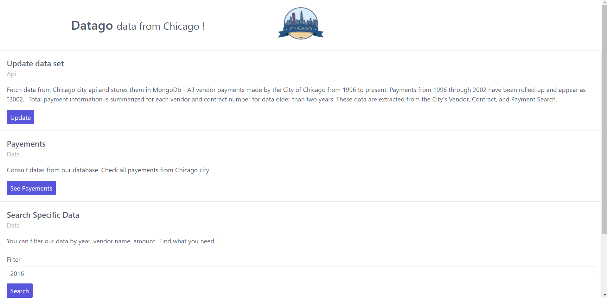
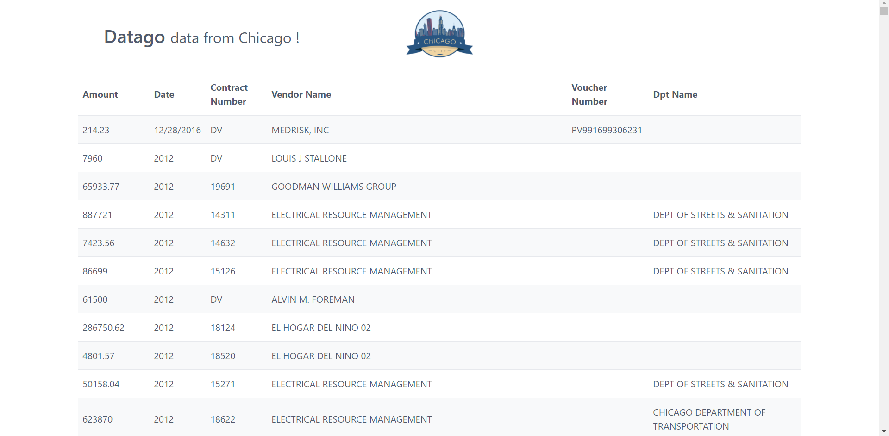
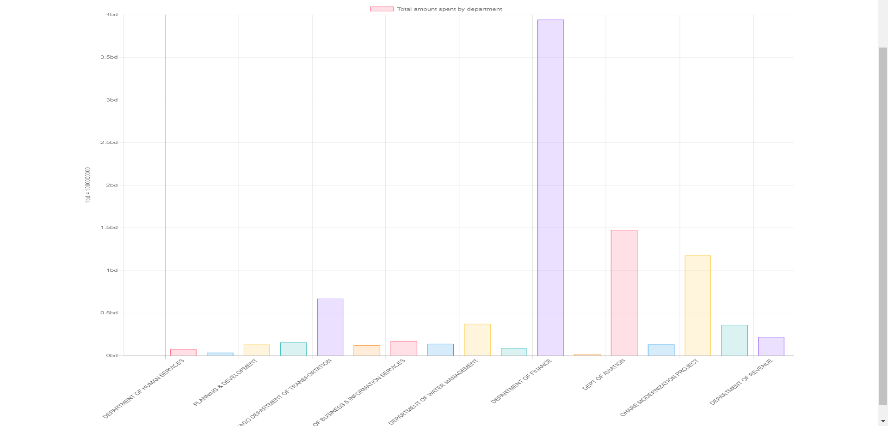

# opendata
Fetch data from api, stores them in mongodb, make some requests and charts with them

=========

* Backend : Node - Express - MongoDB
* Templating: PUG
* Other: ChartJs

Presentation
--------------------

The application looks like this: 

Installation
--------------------
1. Clone the repository `git clone https://github.com/Svanaks/opendata.git`
2. Run `npm install` to install all the packages needed for the app to work.
3. To run the application `npm start` and then go on localhost:3000

If you just want to see how it looks, you can see some pictures and a description on my [personal website](http://williambloch.com)

